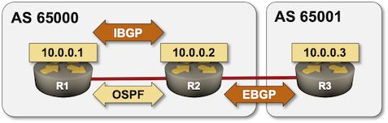

The network simulation tools ([netsim-tools](https://netsim-tools.readthedocs.io/en/latest/install.html)) help you build, deploy, and configure complex virtual lab topologies. The only two limits are the amount of CPU/RAM you have available, and your imagination... but one should start with smalls steps, so here we are.

Let's get familiar with netsim-tools first. In this scenario, you'll build a three-router virtual lab running OSPF, IBGP and EBGP on FRRouting containers supported by [Containerlab](https://blog.ipspace.net/2021/04/netsim-containerlab.html).

